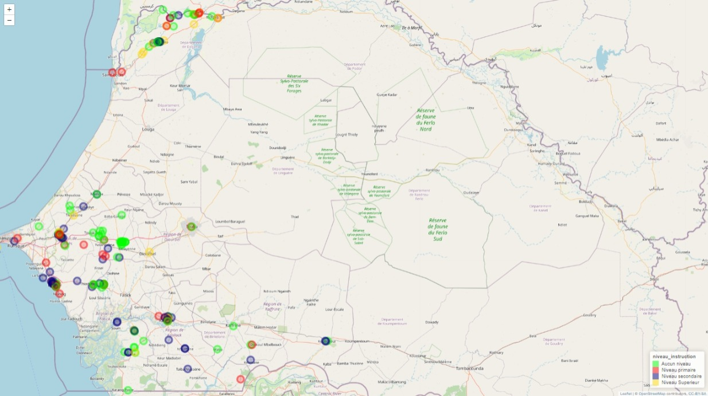
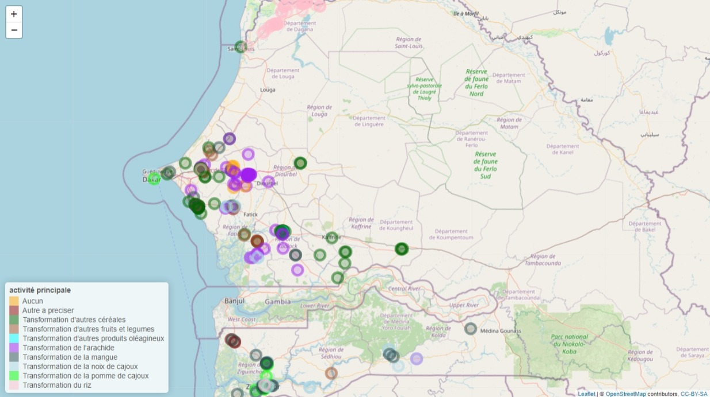

```{r setup, include=FALSE}
library("tidyverse")
library("questionr")
library("knitr") # pour les tableaux 
library("GGally")
library("scales")
library("janitor")
library("readxl")
library("gtsummary")
library("psych")
library("janitor")
library("rnaturalearth")
library("stringr")
library("dplyr")
library("plyr")
library("cartography")
library( "classInt")
library("ggspatial")
library("leaflet")
library("maptools")
library("htmlwidgets")
library("webshot")
library("osrm")
#ibrary("popcircle")
library("raster")
library("RColorBrewer")
library("rgdal")
library("rgeos")
library("sf")
library("sp")
library("tmaptools")
library("stringr")
library("readxl")

knitr::opts_chunk$set(echo = FALSE,message=FALSE,warning=FALSE)

```

# partie1

## I- Préparation des données

### Description

Le fichier Base_Partie1.xlsx contient 250 observations et 33 variables.La première colonne key correspond à l'identifiant de la PME

-   **Importation et mise en forme**

-   Importer la base de données dans un objet de type data.frame nommé projet

```{r}
knitr::opts_chunk$set(echo = TRUE)
projet<-data.frame(read_xlsx("Base_Partie 1.xlsx"))

```

-   **Faites un tableau qui resume les valeurs manquantes par variable**

notre code, avec la fonction colSums associer a kable, nous retourne un vecteur colonne contenant les valeurs manquantes resumées par variable .

```{r}
valeur_manquante<-projet %>% summarize_all(~sum(is.na(.)))
kable(t(valeur_manquante), caption ="valeurs manquantes" )

```

**Vérifier s'il y a des valeurs manquantes pour la variable key dans la base projet. Si oui, identifier la (ou les) PME concernée(s).**

ce code nous renvoi le nombre de valeurs manquantes dans la variable key de la base projet.la variable key de cette base n'a en fait pas de valeurs manquantes.

```{r}
dplyr::select(projet,which(is.na(projet$key))) %>% kable(.,caption =" individus à key manquant" )                                   # ce code génère un tableau sans aucune ligne d'observation car toute les lignes d'observations ont des key


sum(is.na(projet$key))                        # ce code retourne le nombre de valeur manquante dans la variable key c'est à dire 0.
```

### Création de variables: (l'objet projet sera modifié ici)

-   **Renommons les variables q1, q2 et q23**

Avec la fonction **"rename"** nous allons renommer la variable q1 en **region**, q2 en \***departement**, et **q23 en sexe**.

```{r}
projet<-dplyr::rename(projet,region=q1,departement=q2,sexe=q23)
names(projet)
```

-   **Créer la variable sexe_2 qui vaut 1 si sexe égale à Femme et 0 sinon.**

Avec la condition if_else de dplyr, ce code nous permet de creer la variable sexe_2 qui prend **1**, si la variable sexe est "femme" puis **0** si c'est homme.

```{r}
projet$sexe_2<-if_else(projet$sexe=="Femme",1,0)
head(projet)
```

-   **Créer un data.frame nommé langues qui prend les variables "key" et les "variables" correspondantes décrites plus haut.**

Ce code, construit autour de la fonction **"select"** de dplyr, permet de créer un data.frame() nommé langues qui prend la variable key et toutes les variables commençant par **"q24a\_"**

```{r}
langues<-dplyr::select(projet,key,starts_with("q24a_"))%>%data.frame()
```

-   **Créer une variable "parle" qui est égale au nombre de langues parlées par le dirigeant de la PME.**

Pour creer la variable **"parle"**, on peut appliquer le code ci-dessous, en prenant d'abord le data.frame() "langues" puis en retranchant la variable key. Notre variable colonne ainsi creer prend la somme par ligne des variables commençant par q24a\_.

```{r}
langues$parle<-rowSums(langues[,-1])

```

-   **Sélectionnez uniquement les variables key et parle, l'objet de retour sera langues.**

```{r}
langues<-langues %>%dplyr::select(key, parle)
head(langues)

```

-   **Fusionner les data.frame "projet" et "langues":**

ce code nous permet d'obtenir une base "mergered" par la combinaison dela base projet avec la data.frame()"langues" par l'intermediaire d'une clé

```{r}
 mergered<-merge(projet,langues, by="key")
head(mergered,5)
```

## II- Analyses descriptives

### Quelle est la réparation des PME suivant :

-   **le sexe?**

tbl_summary permet de ressortir des statistiques decriptives suivant la variable sexe de la base " mergered".

```{r}
tbl_summary(mergered, 
              include=sexe) %>%
    modify_spanning_header(all_stat_cols()~"**Répartition des PME selon le sexe**")
  
```

Les statistiques nous montrent que 76% des PME sont dirigées par des femmes contre 24% dirigees par des hommes.

-   **le niveau d'instruction?**

il ressort que, parmis les dirigeants des PME 16% ont un niveau superieur, 30% ont un niveau secondaire, 22% ont un niveau primaire et ceux n'ayant pas mun viveau d'instruciton representent 32%de l'ensemble.

```{r}
tbl_summary(mergered, include= c(q25),
              label = q25~"niveau d'instruction") %>%
    modify_spanning_header(all_stat_cols()~"**Répartition des PME selon le niveau d'instruction**")
  
```

-   **suivant le statut juridique?**

76% des entreprises etudiées sont organisées en GIE. Les S.A et les SUARL represente seulement

```{r}
tbl_summary(mergered, 
              include= c(q12),
              label = q12~"statut juridique") %>%
    modify_spanning_header(all_stat_cols()~"**Répartition des PME selon le statut juridique**")
  
```

-   **le propriétaire/locataire?** ON a 90% des dirigeants de ces dirigeants sont propriétaires

```{r}
tbl_summary(mergered,
              include= c(q81),
              label = q81~"propriétaire/locataire")%>%
    modify_spanning_header(all_stat_cols()~"**Répartition des PME selon le propriétaire/locataire**")
  
```

-   **le statut juridique et le sexe?** 60% des PME sont des GIE avec dirigés par de femmes .

```{r}
tbl_cross(mergered,
              percent="cell",
              row=q12,
              col=sexe,
              label = q12~" statut juridique") %>% modify_spanning_header(all_stat_cols()~"**Répartition des PME selon le statut juridique et le sexe**")
  
```

-   **le niveau d'instruction et le sexe?**

Jusqu'à 47% des PME etudiés sont dirigées par des femmes avec un niveau d'instruction inféreur ou egal au niveau primaire et 28% des PME ont a leurs tête des femmes non instruites.

```{r}
tbl_cross(mergered,
              row="q25",
             col="sexe",
           percent="cell",
              label = q25~"niveau d'instruction") %>%
    modify_spanning_header(all_stat_cols()~"**Répartition des PME selon le niveau d'instruction et le sexe**")
  
```

-   **Propriétaire/locataire suivant le sexe ?**

77% des propriétaires sont des femmes tout comme 67% des locataires.

```{r}
tbl_summary(mergered, percent = "row",
              include= q81,
              by=sexe,
              label = q81~" propriétaire/locataire") %>%
    modify_spanning_header(all_stat_cols()~"**Répartition du propriétaire/locataire selon le sexe**")
```


##III- Un peu de cartographie

-   **Transformer le data.frame en données géographiques dont l'objet sera nommé projet_map:**

```{r}

sn<-st_read("données_SEN/gadm36_SEN_1.shp")
projet_map <- st_as_sf(mergered, coords = c("gps_menlongitude", "gps_menlatitude"), crs = st_crs(sn))
projet_map<-st_join(projet_map,sn)

```

Dans la suite, nous utiliserons les packages ggplot2 et leaflet, pour une representation spatiale des PME de la base au sein de l'espace geographique du Senegal.Ainsi,les cartes ci-dessous permettent de representer respectivement une vue global de la disposition spatiale des PME selon le sexe du dirigeant. Nous avons ainsi generée une carte illustrative du senegale sur laquelle nous apprecions la concentration des PME, selon les variables de discrimination(ggplot2) , à laquelle nous associons une capture de la localisation de ces PME sur une carte map interactive du senegal(le code leaflet permet de creer la carte interactive).

-   **Faites une réprésentation spatiale des PME suivant le sexe:**

```{r}

# Créer la carte pour représenter les PME en fonction du sexe avec ggplot2
carte_sexe <- ggplot() + 
  geom_sf(data=sn)+
  geom_sf_text(data=sn, aes(label = NAME_1 ))+
  geom_sf(data = projet_map, aes(color = sexe))+
  scale_color_manual(values = c("blue", "pink"))+
  theme_void()+ 
  labs(title = "Carte de representation spatiale des PME suivant le sexe du dirigeant ") + theme(legend.position = "bottom")

carte_sexe


couleurs_sexe <- colorFactor(c("blue", "pink"), domain = projet_map$sexe) #pour Définir les couleurs pour chaque valeur de la colonne "sexe" 

v <- leaflet() %>%   addTiles() %>%   addCircleMarkers(data = projet_map,color = ~couleurs_sexe(sexe))%>%    addLegend(position = "bottomright",    pal = couleurs_sexe,    values = projet_map$sexe, title = "Sexe") # pour construire une carte interactive oofrant la visualisation de la disposition spatiale des PME
knitr::include_graphics("Sexe.jpeg")
```

```{r, out.width='75%'}

```

-   **Faites une réprésentation spatiale des PME suivant le niveau d'instruction**

```{r}
carte_niveau_instruction <- ggplot() + 
  geom_sf(data=sn)+
  geom_sf_text(data=sn, aes(label = NAME_1 ))+
  geom_sf(data = projet_map, aes(color = q25))+
  scale_color_manual(values = c("green", "red","navy","gold"))+
  theme_void()+ 
  labs(title = "Carte de l'Afrique de l'Ouest") + theme(legend.position = "bottom")

carte_niveau_instruction
```

```{r, out.width='75%'}
carte_niveau_instruction <- colorFactor(c("green", "red","navy","gold"), domain = projet_map$q25) 

v <- leaflet() %>%   addTiles() %>%   addCircleMarkers(data = projet_map,color = ~carte_niveau_instruction(q25))%>%    addLegend(position = "bottomright",    pal = carte_niveau_instruction,    values = projet_map$q25, title = "niveau_instruction") 

saveWidget(v, file = "niveau_instruction.html")

```

-   **Faites une analyse spatiale de votre choix**

Nous presenterons réprésentation geographique des PME suivant leur activité principale. ceci permettrait d'apprecier les secteurs propices aux differentes activités ou zone de concentration des activités fares des filières de la base de donné.

```{r}
carte_niveau_instruction <- ggplot() + 
  geom_sf(data=sn)+
  geom_sf_text(data=sn, aes(label = NAME_1 ))+
  geom_sf(data = projet_map, aes(color = q8))+
  scale_color_manual(values = c("orange", "darkred","darkgreen","sienna","cyan","purple","darkslategray","lightblue","green","pink"))+
  theme_void()+ 
  labs(title = "Carte de l'activité_principale au sein du pays") + theme(legend.position = "bottombright")

carte_niveau_instruction
```

```{r, out.width='100%'}
carte_activité_principale <- colorFactor(c("orange", "darkred","darkgreen","sienna","cyan","purple","darkslategray","lightblue","green","pink"), domain = projet_map$q8) 

v <- leaflet() %>%   addTiles() %>% addCircleMarkers(data = projet_map,color = ~carte_activité_principale(q8))%>% addLegend(position = "bottomleft",    pal = carte_activité_principale, values = projet_map$q8, title = "activité principale") 

saveWidget(v, file = "activité_principale.html") 

```

# Partie 2

Le fichier excel Base_Partie 2.xlsx contient un ensemble de données artificielles créé dans le cadre de ce projet. La première feuille contient des micro-données au niveau individuel des répondants à l'enquête, la deuxième feuille contient des données pour les districts dans lesquels les répondants de la première feuille ont été interrogés. La troisième feuille contient des explications sur les variables incluses dans toutes les feuilles précédentes.

## Nettoyage et gestion des données

```{r}

data<-read_xlsx("Base_Partie 2.xlsx")
```

-   **nommer la variable "country_destination" en "destination" et définir les valeurs négatives comme manquantes**

ce code renomme d'abord country_destination en destination, dans la base (base3). Cette variable renvoi par la suite NA si les valeurs de la variable sont negatives puis conserve les anciennes valeurs si non.

```{r}
data<-dplyr::rename(data, destination = country_destination)

data$destination<-if_else(data$destination<0,NA,data$destination)
```

-   **Créer une nouvelle variable contenant des tranches d'âge de 5 ans en utilisant la variable "age".**

ce code permet d'ordonner d'abord la base3, puis ensuite de construire des tranches d'ages suivant la variable age

```{r}
data<-data%>%arrange(age)
data$class_age<-cut(data$age,
                    breaks=seq(min(data$age),max(data$age)+1,by=5)
                    ,right=F,
                    include.highest=T)
```

-   **Créer une nouvelle variable contenant le nombre d'entretiens réalisés par chaque agent recenseur.**

Transforme permet de conserver les variable en integrant une autre variable apres avoir convertis l'id et enumerator comme des facteurs,nous avons creer un tableau (nbmod) recuperant la variable enumerate. enfin nous avions creer la variable entretient qui prend le nombre de modalite de la variable enumerate.

```{r}
data <- data %>%
  group_by(enumerator) %>%
 dplyr::mutate(num_interviews = n())
view(data)

```

-   **Créer une nouvelle variable qui affecte aléatoirement chaque répondant à un groupe de traitement (1) ou de controle (0).**

```{r}
data <- data %>%
  dplyr::mutate(alea_affectation= sample(0:1, n(), replace = TRUE))

```

-   **Fusion de la taille de la population de chaque district (feuille 2) avec l'ensemble de données (feuille 1) afin que toutes les personnes interrogées aient une valeur correspondante représentant la taille de la population du district dans lequel elles vivent:**

```{r}
# Importer les données de la feuille 1
district_data <- read_excel("Base_Partie 2.xlsx", sheet = "district")
data <- merge(data, district_data, by = "district", all.x = TRUE)
```

-   **Calculer la durée de l'entretien et indiquer la durée moyenne de l'entretien par enquêteur.**

```{r}
# Calculer la durée de l'entretien
data$durée_interview <- as.numeric(data$endtime - data$starttime)

# Calculer la durée moyenne de l'entretien par enquêteur
moyenne_durée_enquêteur <- ddply(data, "enumerator", summarise, moyenne_durée= mean(durée_interview))
kable(moyenne_durée_enquêteur,caption ="Durée moyenne de l'entretien par enquêteur")

```

-   **Renommez toutes les variables de l'ensemble de données en ajoutant le préfixe "endline\_" à l'aide d'une boucle.**

```{r}
# Récupérer les noms des colonnes
col_names <- names(data)

# Boucle pour renommer les colonnes avec le préfixe "endline_"
for (col in col_names) {
  data <- data %>%
    rename_with(.cols = col, .fn = ~str_c("endline_", .))
}


```

## Analyse et visualisation des données

nous effuctuerons prealablement check-up de la base de donnée pour detecter d'eventuels elements qui fausserait la suite de nos analyses et tests

```{r}
kable(summary(data))
```

nous constatons,aux vu des statistiques generales des variables, la presence de valeurs extrêmes au niveaux de la variable âge de la base. nous procèderons à une imùputation par la methode de la mediane afin remplacer les valeurs dont l'ecart à la median est superieur 1,5\*Interval interquartile de cette variable. le code suivant nous permet de le faire:

```{r}
library(janitor)
# Remplacons les valeurs aberrantes de la variable "age" par la médiane de l'âge
data_net<- data %>%
 mutate(endline_age = ifelse(endline_age < 0 | endline_age > 120,  median(data$endline_age, na.rm = TRUE), endline_age))

# Visualisons le résumé statistique après le nettoyage
summary(data_net)

```

-   

- **Testez si la différence d’âge entre les sexes est statistiquement significative au niveau de 5 %.**


N'ayant encore vu le cours sur les tests, les resultats obtenus ne seront pas commentés.

```{r}
# Étape 1: Sélectionnonsement les colonnes "sex" et "age"
data_age_sex <-data_net %>%
  dplyr::select(endline_sex, endline_age)


# Étape 2: Effectuons test de Student (t-test) pour comparer les moyennes entre les sexes
result_test <- t.test(endline_age ~ endline_sex, data = data_age_sex)
# Étape 3: Affichons résultats du test
print(result_test)
```

-   **Créer un nuage de points de l'âge en fonction du nombre d'enfants**

```{r}
# Créer le nuage de points
nuage_points <- ggplot(data_net, aes(x =endline_children_num, y = endline_age)) +
  geom_point(size = 3, alpha = 0.7,colour="blue") +
  labs(x = "Nombre d'enfants", y = "Âge", title = "Nuage de points de l'âge en fonction du nombre d'enfants")

# Afficher le nuage de points
print(nuage_points)
```

-   **Créez un tableau de régression avec 3 modèles dont la variable de résultat est toujours "intention":**

**modele_A:** C'est un modèle de régression logistique de l'effet d'être affecté au groupe de traitement sur l'intention de l'individu.
**modele_B :** C'est un modèle de régression linéaire multiple del'intention de l'individu en fonction du groupe de traitement sur en tenant compte de l'âge et du sexe.
**modele_C :** Régression linéaire multiple pour l'effet du traitement sur l'intention en tenant compte de l'âge, du sexe et du district

```{r}

# Modèle A : Effet du traitement sur les intentions.
modele_A <- glm(factor(endline_intention) ~ endline_alea_affectation, data = data_net, family = "binomial")

# Modèle B : Effet du groupe de traitement, de l'âge et du sexe , sur les intentions. 
modele_B <- lm(endline_intention ~ endline_alea_affectation + endline_age + endline_sex, data = data_net)

# Modèle C : Identique au modèle B mais en contrôlant le district.
modele_C <- lm(endline_intention ~ endline_alea_affectation +endline_age+ endline_sex  + endline_district, data = data_net)

# Créer un tableau récapitulatif avec les résultats des trois modèles
tableau_regression <- data.frame(
  Modèle = c("Modèle A", "Modèle B", "Modèle C"),
  Type_Modele = c("Régression Logistique", "Régression Linéaire Multiple", "Régression Linéaire Multiple"),
  Variables_Explicatives = c("Aucune (Modèle Vide)", "Âge, Sexe", "Âge, Sexe, District"),
  R2 = c(summary(modele_A)$null.deviance - summary(modele_A)$deviance, summary(modele_B)$r.squared, summary(modele_C)$r.squared),
  Coefficients_Estimés = c(coef(modele_A)["treatment_group"], coef(modele_B)["treatment_group"], coef(modele_C)["treatment_group"]),
  P_Value_Traitement = c(summary(modele_A)$coefficients[2, "Pr(>|z|)"], summary(modele_B)$coefficients[2, "Pr(>|t|)"], summary(modele_C)$coefficients[2, "Pr(>|t|)"])
)

# Afficher le tableau récapitulatif
kable(tableau_regression)

```
